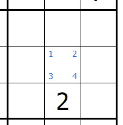
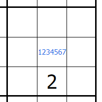

# Projet de session

Le projet que vous aurez à réaliser durant le cours de cette session est un outil permettant de résoudre des grilles Sudoku. L'objectif est de vous faire implémenter un logiciel avec différents composants qui interagissent essemble, tout en conservant une conceptualisation claire et efficace.

Vous n'avez pas besoin d'être capable de résoudre des Sudoku vous même pour compléter ce travail. Cependant, la page Wikipédia sur le sujet peut vous être utile pour comprendre de quoi il s'agit: [https://fr.wikipedia.org/wiki/Sudoku](https://fr.wikipedia.org/wiki/Sudoku).

# Phase 1

## Spécifications générales

Voici les grandes lignes de ce que votre application devra contenir :

* Une interface graphique d'une grille 9x9 où l'ont peut insérer des chiffres à différents endroits.
* Un système qui vérifie si l'état actuel Sudoku est valide ou non.
* Une fonctionnalité de sauvegarde et chargement d'une grille.
* Une batterie de test unitaires automatisés qui vérifie chaque fonctionnalité.

De plus, vous devrez fournir un rapport contenant les informations suivantes :

* Cinq exemples dans votre code qui démontrent l'application de chacun des 5 principes SOLID.
* Trois exemples dans votre code qui démontrent l'application de chacun un principe GRASP différent.
* Chaque exemple doit être accompagné d'explications et justifications.

Finalement, vous devrez me présenter votre programme fonctionnel à la date de remise. Les présentations seront faites en classe, mais pas devant le groupe entier. Vous aurez chacun une plage horaire de 10 minutes pour me présenter votre programme.

## Spécifications détaillées

Suit les détails des spécifications qui vont être vérifiés lors de la correction.

### Techonologies

Vous pouvez utiliser le langage et les librairies que vous voulez pour compléter ce travail. Cependant, prenez note que vous êtes évalués en parties sur la démonstration de votre compréhension des principes orientés objet vu en classe et dans les notes de cours. Par conséquent, si vous choisissez un langage qui ne supporte pas l'orienté objet, votre tâche sera d'autant plus difficile.

### Code source

Peu importe les technologies choisies, votre code source, ainsi que votre rapport, devra se retrouver dans le dépôt Git prévu pour ce travail. Il n'est pas nécessaire d'inclure l'exécutable dans le dépôt.

### Interface graphique

Votre application doit avoir une interface graphique. Cet interface devra représenter une grille Sudoku 9 x 9 où l'ont peut entrer des chiffres de 1 à 9 :

La grille doit être visiblement séparée en 9 boîtes de 3 x 3 (voir image ci-dessus).

De plus, votre interface devra supporter deux types de notations spéciales :

* On peut entrer des chiffres (au moins 4 différents) dans les coins des cases :

* On peut entrer des chiffres au centre des cases :

* Dans toutes les situations, il est impossible d'entrer plus d'une fois le même chiffre dans une case.

Votre interface graphique devra être conviviale et facile d'utilisation, avec une manière claire et rapide de changer le mode de notation.

### Vérification de l'état de la grille

Vous devrez avoir une fonctionnalité dans votre application qui vérifie si une erreur est présente dans la grille en tout temps. Ici, on parle d'une erreur quand un même chiffre se retrouve :

* Dans une même ligne, ou
* Dans une même colonne, ou
* Dans une même boîte 3x3.

L'erreur devra être signalée de façon visuelle et claire à l'utilisateur, sans être dérangeant (pas de boîte de dialogue qui s'affiche soudainement!).

### Sauvegarde et chargement

Votre application doit permettre à son utilisateur de sauvegarder une grille en cours dans un fichier et de charger une grille sauvegardée. Il n'y a pas de format particulier à respecter pour le fichier de sauvegarde.

### Tests unitaires

Vous devrez réaliser une batterie de tests unitaires automatisés pour les deux fonctionnalités présentées ci-dessus. Vos tests ne doivent avoir aucune dépendence sur le système (e.g. aucun test ne devrait tenter d'écrire ou de lire un fichier sur le disque). Vous n'avez pas à tester l'interface graphique.

### Rapport

Vous devez fournir un rapport qui contient les informations suivantes :

* Cinq (5) exemples dans votre code qui démontrent l'application de chacun des 5 principes SOLID.
* Trois (3) exemples dans votre code qui démontrent l'application de chacun un principe GRASP différent.
* Chaque exemple doit être accompagné d'explications et justifications.

Votre rapport devra *obligatoirement* être en format Markdown et être déposé à la racine de votre dépôt Git sous le nom README.md. De cette façon, je pourrai consulter votre rapport directement en allant sur la page de votre Git.

Pour un guide d'utilisation de Markdown sur Git, vous pouvez consulter la page suivante : [https://guides.github.com/features/mastering-markdown/](https://guides.github.com/features/mastering-markdown/)

Sinon, les notes de cours disponibles sur le Github du cours (incluant ce document) sont toutes écrites en Markdown, alors vous pouvez télécharger ces fichiers et les consulter comme guide.

## Présentation

Le 4 novembre, vous aurez à me présenter votre application fonctionnelle. Il ne s'agit que de me montrer le bon fonctionnement de chacune des fonctionnalités présentées ci-haut. Vous aurez un maximum de 10 minutes pour présenter votre application.

Je vous recommende d'amener un ordinateur portable pour présenter, mais si c'est impossible, vous pourrez utiliser l'ordinateur du local 4020.

## Travail d'équipe

Le travail est à réaliser en équipes de 4 ou 5. Vos équipes sont normalement déjà formées. Si vous n'avez pas d'équipe, veuillez me le faire savoir au plus vite et je vous ajouterai à une équipe existante au hasard.

**_Les travaux remis individuellement ne seront pas évalués!_**

## Dépôt Git

Vous pouvez obtenir votre dépôt Git au lien suivant : [https://classroom.github.com/a/isxJen-9](https://classroom.github.com/a/isxJen-9).

## Critères de correction

Votre évaluation repose en partie sur la présentation de votre logiciel et sur la qualité de votre rapport. Voici les critères d'évalution.

| Critère                                         | Poids |
| ---                                             | ---   |
| Présentation : Application fonctionnelle        | 40%   |
| Présentation : Convivialité et qualité visuelle | 10%   |
| Rapport : Démonstration des principes SOLID     | 30%   |
| Rapport : Démonstration de 3 patrons GRASP      | 20%   |

## Remise des travaux

Votre code et rapport devront être déposés sur votre Git avant le 4 novembre 23h00.

Bonne chance!

# Étude de cas

Cette section concerne les équipes participantes à l'étude de cas. Les règles et modalités concernant l'étude sont décrites ci-bas. Si vous ne participez pas, vous pouvez ignorer cette section sans problème.

## Modalités

Comme mentionné en classe, chaque équipe participant à l'étude de cas se verra attribué une couleur (vert ou mauve). Les couleurs sont attribués par un algorithme aléatoire. Chaque couleur aura un ensemble de règles supplémentaires à respecter dans leur code. Ces règles sont décrites plus bas dans cette section.

Pour compenser les restrictions supplémentaires ajoutées au projet, toutes les équipes participantes auront droit à un bonus de 10% sur les deux phases du projet de session. 

*Attention: ce bonus de 10% est contingent au respect des règles associées à votre groupe dans l'étude. Si vous ne respectez pas ces règles, vous n'aurez pas le 10% et je ne pourrai pas utiliser votre projet dans l'étude.*

## Contrat

Chaque équipe voulant participer à l'étude de cas devra consentir aux éléments suivants :

* Vous me permettez d'utiliser le code source de votre projet de session pour faire des analyses et d'en publier les résultats.
* Votre code source ne sera pas rendu public sans votre consentement.
* Vos informations personnelles (incluant votre nom) ne seront pas divulguées.

## Objectif de l'étude

L'objet de l'étude est de déterminer si la programmation orientée-objet à l'aide objets immuable a un impact significatif sur la qualité du code. Pour en arriver là, les participants de l'étude seront divisés en deux groupes : un groupe développera leur projet en utilisant des pratiques classiques orientée objets, et l'autre groupe utilisera de l'orienté-objet avec objets immuables. À la fin de l'étude, vous aurez l'occasion d'émettre des commentaires si vous le voulez.

Une fois les projets développés, différentes analyses seront faites sur le code source de chaque projet pour comparer des métriques de complexité (taille du code, couplage, complexité, etc.). Vos commentaires seront aussi pris en compte. Si des conclusions peuvent être tirées de ces analyses, elles pourront par la suite être publiées dans un journal scientifique.

## Règles de développement

Ci-suit les règles que chaque groupe devra suivre pour développer leur application.

### Groupe Vert

Le groupe vert développera leur projet en utilisant la méthodologie orientée objet classique. En plus des concepts vus dans les notes de cours qui doivent être inclus dans votre projet, votre code devra respecter les règles suivantes :

* Évitez de créer des objets inutilement. Réutiliser les objets existants lorsque possible (dans la mesure du raisonabble).
* Lorsqu'utile, vos objets peuvent avoir des méthodes qui changent leur état (e.g. setters).
* Respectez les règles d'encapsulation : vos attributs doivent être privés. Utilisez des getters setters (ou propriétés si supportées par le langage) pour accéder et modifier vos objets.

### Groupe Mauve

Le groupe mauve développera leur projet en n'utilisant que des objets immuables. En plus des concepts orientés-objet vus dans les notes de cours qui doivent être inclus dans votre projet, votre code devra respecter les règles suivantes :

* Tous les attributs de vos objets sont read-only. Si vous devez modifier un objet, créez-en un nouveau à la place.
* Vos méthodes "setters" doivent retourner un nouvel objet plutôt que modifier l'objet existant (voir TP1).
* Votre code peut se fier au fait que l'état d'un objet ne changera jamais.
* Respectez tout de même les règles d'encapsulation : vos attributs doivent être privés. Utiliser des getters (ou propriétés read-only si supportées par le langage) pour accéder aux attributs de vos objets.
* Les classes et objets muables provenant d'une librairie (e.g. librairie d'affichage graphique) peuvent être utilisés et modifiés normalement, mais devrait autant que possible être séparé du reste du code (i.e. ne placez pas un objet muable dans un attribut d'un objet immuable).

*Attention: votre code n'a pas à être 100% immuable; seulement vos objets. Vous pouvez quand même créer des variables locales et les modifier dans votre code sans problème.*
